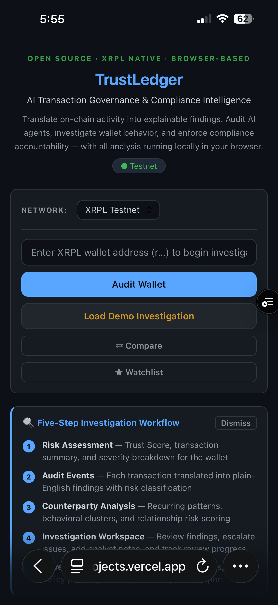
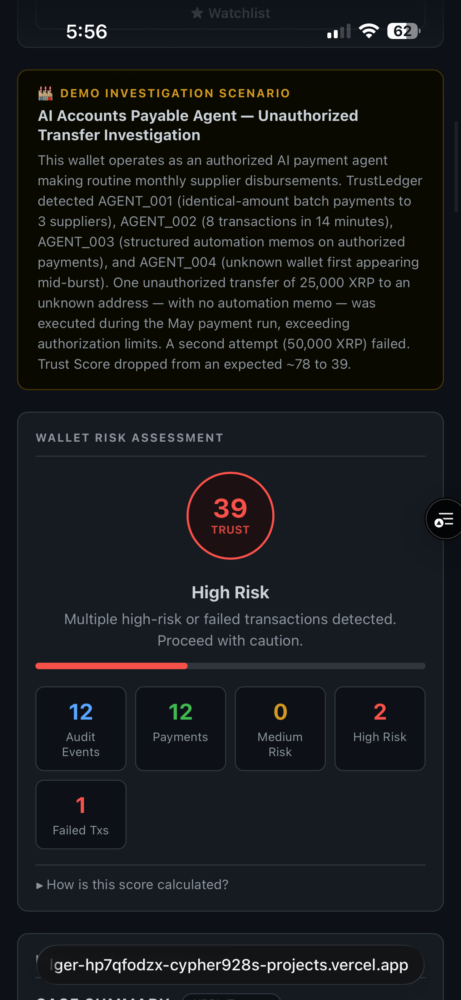
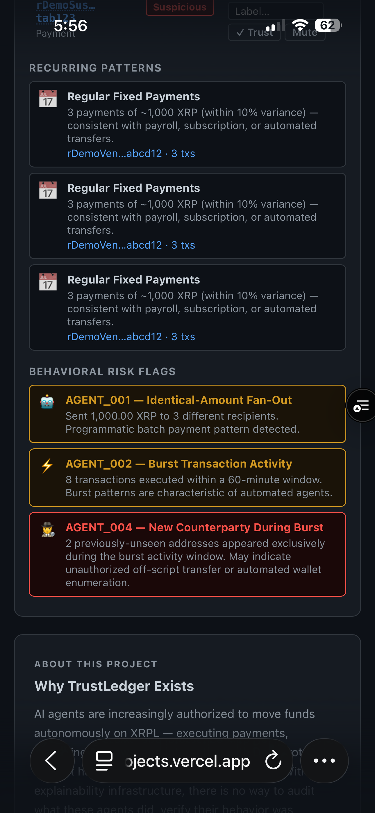
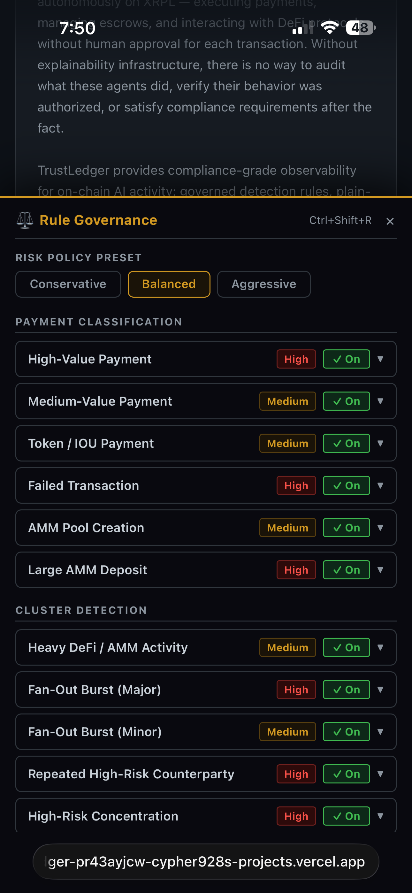
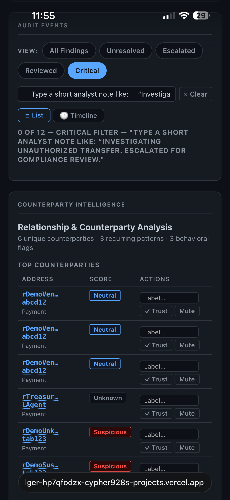
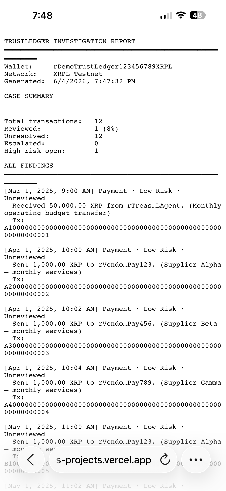

# TrustLedger

**Explainable AI transaction governance infrastructure for XRPL.**

**[Try it live → trustledger-tau.vercel.app](https://trustledger-tau.vercel.app)**

TrustLedger is a single-file, zero-dependency browser application that provides compliance-grade observability for XRPL wallets — with a focus on auditing wallets controlled by AI agents, automated systems, or multi-party arrangements where no single human approves each transaction.

---

## What It Does

Paste any XRPL wallet address. TrustLedger fetches up to 300 transactions directly from the XRPL WebSocket API, classifies each one using a governed rule engine, computes a Trust Score, and gives you a structured investigation workspace — all locally in your browser, with no data sent to any external server.

---

## Feature Overview

### Network Support
- **XRPL Testnet** (`wss://s.altnet.rippletest.net:51233`) and **XRPL Mainnet** (`wss://xrplcluster.com`)
- Live network badge, per-network configuration, automatic retry with exponential backoff (up to 3 retries)
- Fetches up to 300 transactions with pagination via XRPL `marker`

### Audit Event Classification
Every transaction is normalized into an **AuditEvent** with a consistent schema:

| Field | Description |
|---|---|
| `type` | Raw XRPL transaction type |
| `plainType` | Human-readable type label |
| `summary` | Plain-English description of what happened |
| `date` | Formatted timestamp |
| `hash` | Transaction hash (links to XRPL explorer) |
| `account` / `dest` | Sender and recipient addresses |
| `amount` | XRP or token amount |
| `risk` | `Low` / `Medium` / `High` |
| `ts` | Raw XRPL epoch timestamp |
| `memo` | Decoded memo text, or `null` |
| `agentIndicator` | `null`, or `'AGENT_003: <label>'` if memo matches an automation pattern |
| `isSender` | Boolean direction indicator |

Recognized types: Payment, EscrowCreate/Finish/Cancel, OfferCreate/Delete, TrustSet, AccountSet, AccountDelete, SetRegularKey, SignerListSet, NFTokenMint/Burn, PaymentChannel operations, AMMCreate/Deposit/Withdraw/Vote/Bid/Delete.

### Trust Score
- 0–100 score computed from risk-weighted transaction counts
- Configurable penalty weights per risk tier (governed via Rule Registry)
- Visual gauge with color-coded zones (High / Medium / Low trust)
- Stats row: total, high-risk, medium-risk, failed, escrow counts

### Rule Governance System
28 governed rules across 5 categories, configurable without touching source code:

| Category | Rules |
|---|---|
| **Classification** | High-Value Payment, Medium-Value Payment, Token Payment, Failed Transaction, AMM Pool Create, AMM Large Deposit |
| **Cluster Detection** | AMM Heavy Usage, Fan-Out Burst (Major/Minor), Repeated High-Risk Counterparty, High-Risk Concentration, Bidirectional Flow, Failed Cluster |
| **Pattern Detection** | Min Transaction Count, Payroll Variance, Vendor Variance |
| **AI Agent Detection** | Identical-Amount Fan-Out (AGENT_001), Burst Transaction Activity (AGENT_002), Automation Memo Detection (AGENT_003), New Counterparty During Burst (AGENT_004) |
| **Trust Score Weights** | High-Risk Penalty, Medium-Risk Penalty, Failed Penalty, Account Delete Penalty, Activity Bonus, Escrow Bonus, Payment Bonus, Agent Penalty |

Three policy presets — **Conservative**, **Balanced**, **Aggressive** — adjust thresholds across all rules simultaneously. Every rule can be individually enabled/disabled, and thresholds can be overridden per-rule. Configuration is exportable/importable as JSON snapshots.

### Relationship & Counterparty Analysis
- Builds a counterparty map across all transactions for the audited wallet
- Detects **recurring patterns**: regular fixed, vendor-like, recurring, irregular, one-time-only
- Detects **cluster flags**: fan-out bursts, high-risk concentration, circular flows, repeated high-risk counterparties, failed transaction clusters
- Counterparties can be labeled, trusted, or muted — stored per address+network in localStorage
- All flags and patterns are explained in plain English

### Investigation Workspace
- Every AuditEvent gets a **finding** with 6 review states: Unreviewed, Reviewed, Dismissed, Escalated, Confirmed Safe, Needs Follow-up
- Analyst notes per finding, immutable **audit trail** (timestamped state transitions)
- Per-wallet investigator notes
- Filter bar: All Findings, Unresolved, Escalated, Reviewed, Critical
- **Export Compliance Report** — structured `.txt` export with wallet summary, all findings, analyst notes, and audit trail entries

### Diagnostics & Observability
- Developer diagnostics panel (Ctrl+Shift+D) with per-phase timing: fetch, translate, score, render, relationships
- Rule trigger counts and governance telemetry
- Safe logging (address-scrubbing regex strips all XRPL addresses from console output)
- Session-level audit count tracking

### Onboarding & UX
- 5-step guide card for first-time users (dismissible, persisted in localStorage)
- Demo mode banner with example scenario context
- Section eyebrow labels for orientation ("Wallet Risk Assessment", "Audit Events")
- Empty states for all major sections
- Grant-facing "Why TrustLedger Exists" section explaining the AI agent accountability problem

---

## Screenshots

| | |
|---|---|
|  |  |
| Hero section and wallet input | Trust Score gauge with risk tier |
|  |  |
| AI agent behavioral flags (AGENT_001–004) | Rule Governance panel with policy presets |
|  |  |
| Investigation workspace — Critical filter and audit trail | Exported compliance report |

---

## Quick Start

No installation required. No server. No build step.

1. Download or clone this repository
2. Open `index.html` in any modern browser
3. Select Testnet or Mainnet
4. Paste an XRPL wallet address and click **Audit Wallet**

See [DEMO_SCRIPT.md](DEMO_SCRIPT.md) for a guided walkthrough and investigation scenario.

---

## Privacy & Security

- **All analysis is local.** No wallet data, transaction data, or analyst notes are transmitted to any external server.
- **No wallet credentials required.** TrustLedger reads public on-chain data only — it never asks for private keys or seeds.
- **Address scrubbing.** The diagnostics layer strips XRPL addresses from all console log output using a regex scrubber (`/r[1-9A-HJ-NP-Za-km-z]{24,34}/g → [addr]`).
- **localStorage only.** Workspace findings, analyst notes, counterparty labels, and rule configuration are stored in browser localStorage, scoped to the user's device.

---

## Architecture

TrustLedger is a single HTML file (~5,000 lines) with no external dependencies, no framework, and no build step. All logic runs client-side using vanilla JavaScript with an IIFE module pattern for encapsulation.

Eight internal modules:

| Module | Storage Prefix | Responsibility |
|---|---|---|
| `safeLog` | — | Address-scrubbing console wrapper |
| `Diag` | — | Timing, rule telemetry, diagnostics panel |
| `WorkspaceStore` | `tl3_` | Findings, review states, analyst notes, audit trails |
| `CounterpartyStore` | `tl4_` | Counterparty labels, trust/mute flags |
| `RuleConfig` | `tl5_` | Rule registry, thresholds, policy presets, trigger counts |
| `AuditHistory` | `tl6_` | Deduped per-wallet audit log with timestamps and scores |
| `WatchlistStore` | `tl7_` | Watched addresses with alert thresholds and labels |
| `TrendStore` | `tl8_` | Per-wallet Trust Score history for trend visualization |

See [ARCHITECTURE.md](ARCHITECTURE.md) for full technical documentation and system diagrams.

---

## Roadmap

The following capabilities are planned but not yet implemented:

- **Multi-wallet comparison** — side-by-side Trust Score and finding summaries for related wallets
- **Historical trend tracking** — Trust Score change over time across repeated audits
- **XRPL token support** — Classification of IOU/trust-line transactions beyond XRP payments
- **Collaborative workspaces** — Shared investigation state across analyst teams (requires backend)
- **Webhook / API output** — Structured compliance report delivery to external compliance systems
- **Formal rule versioning** — Semantic versioning for rule definitions with migration support

---

## License

See [LICENSE](LICENSE).

---

## About

TrustLedger was built to address a real gap: as AI agents increasingly operate autonomous wallets on XRPL — executing payments, managing escrows, and interacting with DeFi protocols without per-transaction human approval — there is no existing tool to audit what they did, explain the behavior in plain language, or satisfy compliance requirements after the fact. TrustLedger provides that infrastructure.
